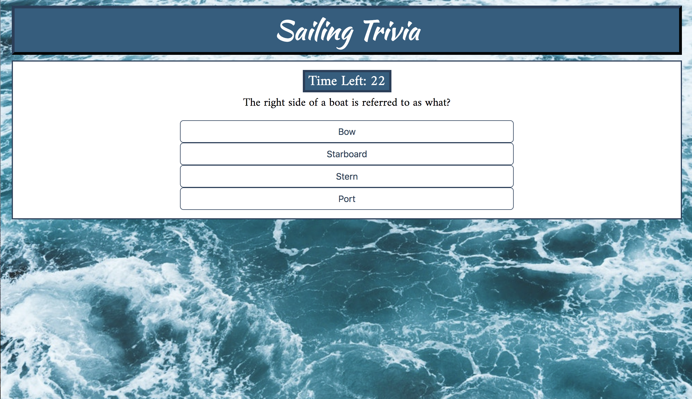
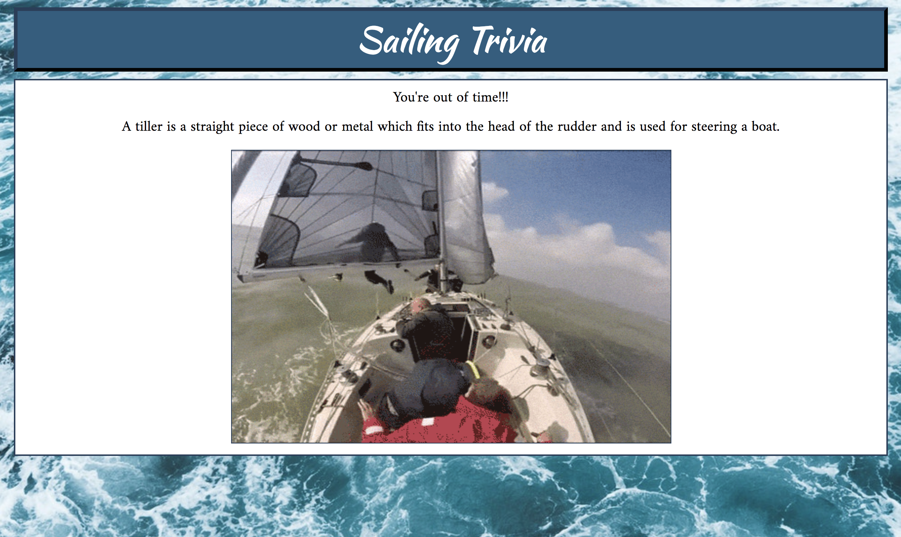

# TriviaGame

Ready to test your Sailing knowledge? Then this Trivia Game is for you. Nine questions, each one with 25 seconds on the timer. As you move through, you'll be rewarded with GIFs eminating how well you did, or an explanation of the answer if you've guessed incorrectly. 

When you get your results, you'll get a chance to Restart the Game if you'd like to try again. Best of luck!

## Languages Used
- HTML5
- CSS
- JavaScript
- jQuery

[Link to Project](https://syddunlap.github.io/TriviaGame/)

## Project Screenshots

